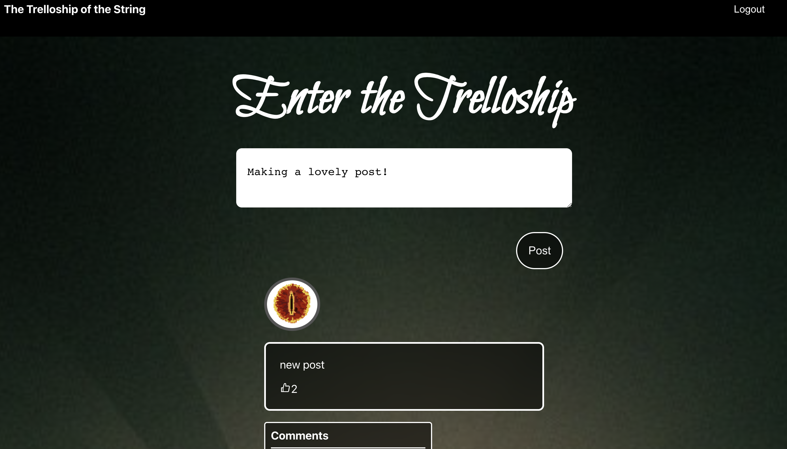

# Acebook

In this group project, we have designed and implemented a Facebook style web app by building upon an existing MERN project.
Over two weeks we had to familiarise ourselves with the inherited codebase and then design user stories and carefully plan tickets to give us an appropriate amount of work during the limited time.

## Pre-existing Features

The original code allowed a user to:
- Sign up
- Sign in
- Sign out
- View a list of posts

## Further Features

We have made changes to allow a user to:
- Create a post
- Like a post
- Comment on a post
- View a randomly assigned avatar image next to their posts

## Technologies used

### Implementation code
- MongoDB
- Express
- React
- Node
- Mongoose for modelling objects in MongoDB
- JSON Web Tokens for user validation

### Testing
- Cypress (front end)
- Jest (api backend)


## Running the program

```bash
# Clone this repository
git clone https://github.com/lplclaremont/trelloship_of_the_string
cd trelloship_of_the_string

# Install the required dependencies
cd api
npm install
cd ../frontend
npm install

# Install and start MongoDB
brew tap mongodb/brew
brew install mongodb-community@5.0
brew services start mongodb-community@5.0

# Start the backend server
cd api
JWT_SECRET=SUPER_SECRET npm start

# In a new terminal start the frontend server
cd frontend
npm start
```

You should now be able to open your browser and go to `http://localhost:3000/` to create a new user by clicking sign-up.
Navigate to login and start making posts and interacting with existing ones!

Below are screenshots of the landing page and posts page

<br>
<br>


<br>
<br>



<br>
<br>


## Testing

#### The Backend (API)
  Start the server in test mode (so that it connects to the test DB)

  ```bash
  cd api
  JWT_SECRET=SUPER_SECRET npm run start:test
  ```

  Then run the tests in a new terminal session

  ```bash
  cd api
  JWT_SECRET=SUPER_SECRET npm run test
  ```

#### The frontend (React)

  Start the server in test mode (so that it connects to the test DB)

  ```bash
  cd api
  JWT_SECRET=SUPER_SECRET npm run start:test
  ```

  Then start the front end in a new terminal session

  ```bash
  cd frontend
  JWT_SECRET=SUPER_SECRET npm start
  ```

  Then run the tests in a new terminal session

  ```bash
  cd frontend
  JWT_SECRET=SUPER_SECRET npm run test
  ```
